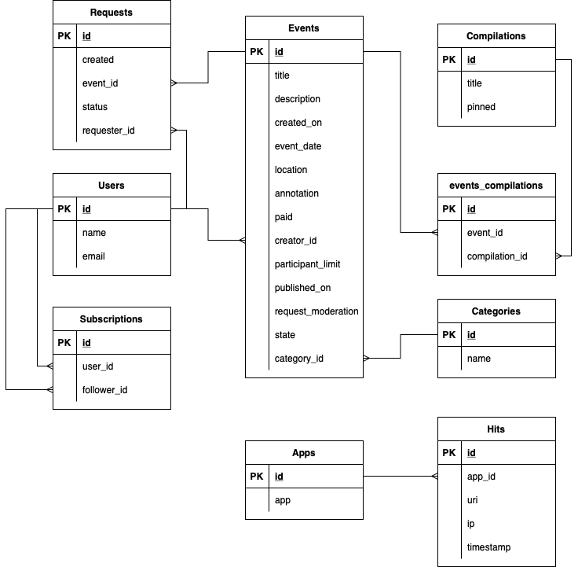

# Explore with Me
Проект: ```Приложение позволяющее делиться информацией об интересных событиях и 
помогать найти компанию для участия в них.```
---
### Описание сервисов:
1. Основной сервис — содержит всё необходимое для работы продукта. 
2. Сервис статистики — хранит количество просмотров и позволяет делать различные выборки для анализа работы приложения.

### Возможности приложения:

1. Управление событиями мероприятий
2. Поиск событий и их посмотр
3. Создание различных подборок мероприятий
4. Публичный и авторизованный доступ пользователей
5. Возможность подписок на зарегистрированных пользователей
6. Управление категориями для мероприятий
7. Возможности модерации для администраторов
---
### Жизненный цикл событие модели данных:
1. Создание.
2. Ожидание публикации. В статус ожидания публикации событие переходит сразу после создания.
3. Публикация. В это состояние событие переводит администратор.
4. Отмена публикации. В это состояние событие переходит в двух случаях. Первый — если администратор решил, что его нельзя публиковать. Второй — когда инициатор события решил отменить его на этапе ожидания публикации.
---
### Схема базы данных 



